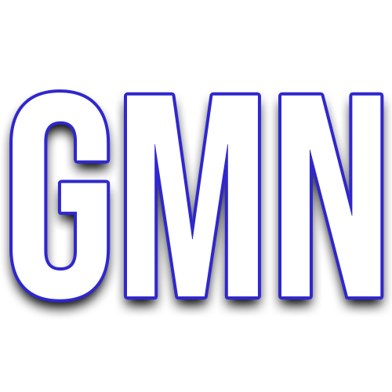
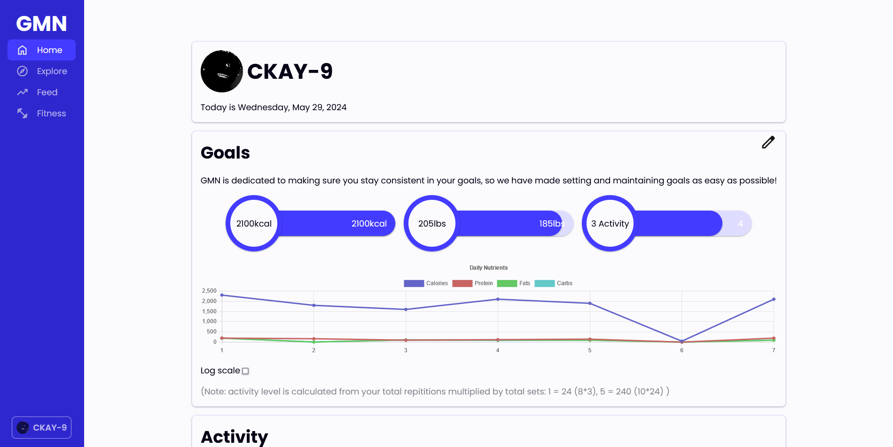
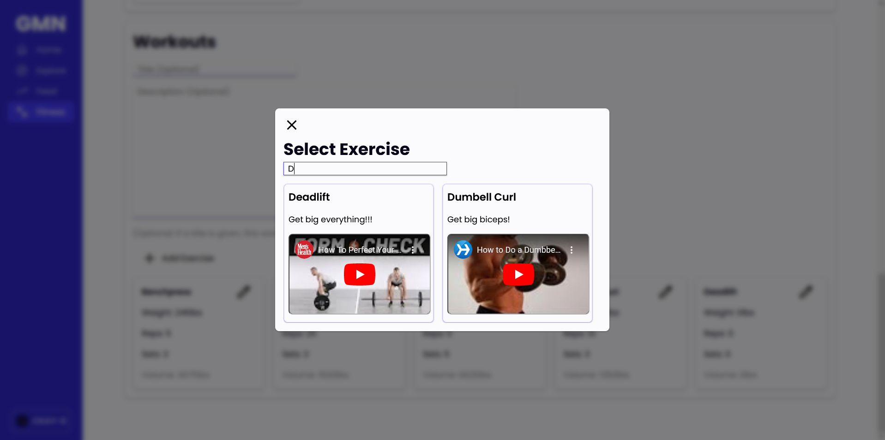
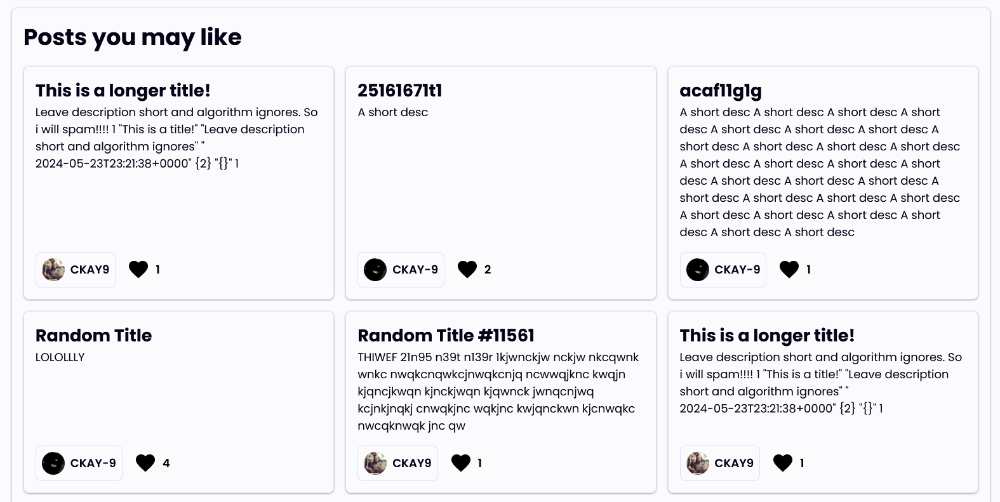
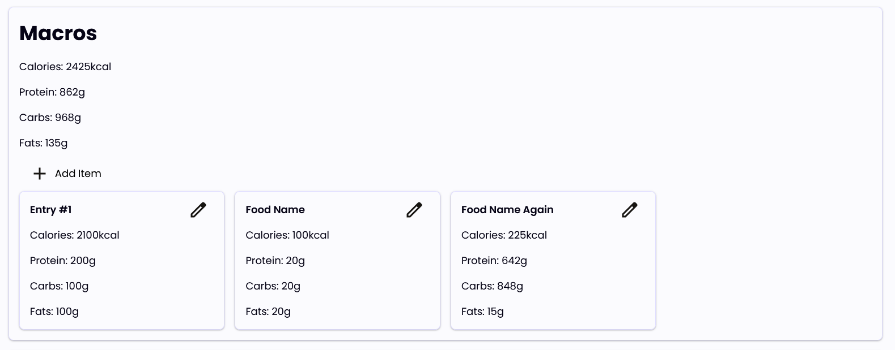

  
   
  

## What is GMN?

GMN (Gyming) is a platform for people to share their fitness goals and progress. This is done through macro (calories, protein, etc.), exercise, health trackers; explore (currently random) and feed (based off followers and following) to find new posts and users; and alike.

  

## Why did you make GMN?

I made GMN because I thought "If someone actually made something like this, I would use it", so I decided to make it. I have a passion for working out and making sure I stay consistent on my goals.

  

## How does GMN work?

Although GMN does have a social platform side, it is primarily a health/tracking tool. This is done through keeping track of daily nutrient intake and activity. These statistics are reset every 24hrs and a blank will be auto-created for the next day.

  

## Developers
GMN is licensed under the AGPL-3.0 (see LICENSE)

GMN's backend is written in Rust using Actix for the API and Diesel for Postgres interaction. The frontend is written in TypeScript using NextJS. Currently, file uploading and displaying isn't implemented but will probably be a simple storage server or a 3rd party service API.

- assets: logo and similar assets
- gmn-frontend: NextJS frontend
- gmn-server: Actix API
